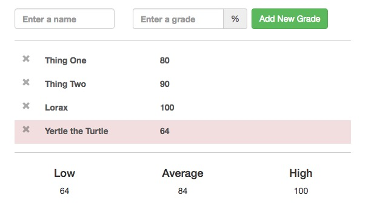

# Gradebook
A simple gradebook app.
The user can add, remove, and update student grades. Basic stats are calculated, and a warning highlights failing grades. Data is stored in localstorage.

Try the demo https://oakley808.github.io/react-gradebook/



## Install
Clone the repo, then install the node modules. Bower modules are packaged with the repo.

```
git clone https://github.com/oakley808/gradebook.git
npm install
```

## Develop
Run the ```gulp watch``` task, then work in the ```/app/``` directory. Your app will run locally at http://localhost:3000/


## Deploy
Push the ```/dist/``` directory to GitHub pages.

```
git subtree push --prefix dist origin gh-pages
```

Your app will be deployed at <code>https://&lt;username&gt;.github.io/gradebook/</code>

## Questions?
Feel free to email me. oakley808@gmail.com
